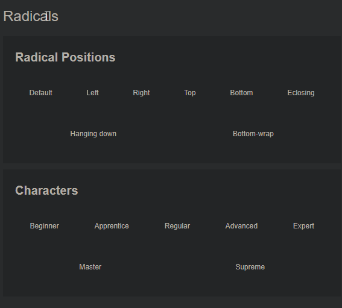

# PageTree

&nbsp;&nbsp;&nbsp;&nbsp;&nbsp;&nbsp;A tool for notes organization in a form of pages as a tree structure with interconnected and internavigatable elements with automatic flashcards generation based on predefined rules.

  

## Technologies

- C# 10 
- .NET 6-7 
- EF Core/MS SQL/.json
- Blazor WASM
- Lucene.NET
- Mediator
- AutoMapper
- WebApi

## Architecture
- Client-Server
- Clean Architecture
- CQRS

## Deliverables
The app prototype is available on https://japanesearcana.com hosted on sharkasp.com

## Features

### Knowledge Structurization

#### Projects
- Create Project
- Update Project (name, description, etc.)
- Archive Project

#### Signatures
- Create Signature
- Rename Signature
- Change Index of Signature
- Delete Signature

#### Pages and Properties Manipulation
- Navigate To / Show Page
- Create Subpage
- Create Subpage From Template
- Create Link
- Rename Page
- Remove Property
- Change Signature of Page
- Change Index of Property
- Change Parent of Property

#### Page Templates
- Navigate To / Show Page
- Create Template Subpage
- Rename Template
- Rename Template Page
- Remove Template Page
- Change Signature of Template Page
- Change Index of Template Page
- Change Parent of Template Page

### Memorization & Repetition

#### Practice Categories
- Create Practice Category
- Rename Practice Category
- Change Index of Practice Category
- Delete Practice Category

#### Practice Tactics
- Create Practice Tactic
- Rename Practice Tactic
- Update Practice Tactic
- Change Index of Practice Tactic
- Delete Practice Tactic

#### Practice
- Generate Practice List

## API

#### Users
| HTTP Method | Endpoint | Description |
| --- | --- | --- |
| `GET` | `api/v1/users/{id}` | Get a user by id |
| `GET` | `api/v1/users/me` | Get user by authentication token |
| `POST` | `api/v1/users` | Create a new user |

#### Projects
| HTTP Method | Endpoint | Description |
| :---: | --- | --- |
| `GET` | `api/projectUserLists/{id}` | Get a specific user list of projects |
| `POST` | `api/v1/projects` | Create a new project |
| `DELETE` | `api/projects/{id}` | Archive a project |
| `PUT` | `api/projects/{id}` | Update project details |

#### Signatures
| HTTP Method | Endpoint | Description |
| :---: | --- | --- |
| `GET` | `api/v1/projects/{projectID}/signatures` | Get all signatures of specific project |
| `POST` | `api/v1/signatures` | Create a new signature |
| `DELETE` | `api/v1/signatures/{id}` | Delete a signature |
| `PATCH` | `api/v1/signatures/{id}/changeName` | Change name of a signature |
| `PATCH` | `api/v1/signatures/{id}/changeIndex` | Change index of a signature |

#### Pages
| HTTP Method | Endpoint | Description |
| :---: | --- | --- |
| `GET` | `/api/pages/{id}` | Get a page |

#### Page Templates
| HTTP Method | Endpoint | Description |
| :---: | --- | --- |
| `GET` | `api/v1/projects/{projectID}/pageTemplates` | Get all page templates of a specific project |

#### Practice Categories
| HTTP Method | Endpoint | Description |
| :---: | --- | --- |
| `GET` | `api/v1/projects/{projectID}/practiceCategories` | Get all practice Categories of a specific project |

#### Practice Tactics
| HTTP Method | Endpoint | Description |
| :---: | --- | --- |
| `GET` | `api/v1/projects/{projectID}/practiceTactics` | Get all practice tactics of a specific project |

#### Practice
| HTTP Method | Endpoint | Description |
| :---: | --- | --- |
| `GET` | `api/v1/pages/{id}/getPracticeList` | Get flashcard practice list from a page and below |

### Other repositories used and required to work:
- https://github.com/Dariusz-L/Corelibs.Basic
- https://github.com/Dariusz-L/Corelibs.BlazorShared
- https://github.com/Dariusz-L/Corelibs.BlazorComponents
- https://github.com/Dariusz-L/Corelibs.AspNetApi
- https://github.com/Dariusz-L/Corelibs.BlazorWebAssembly
- https://github.com/Dariusz-L/Corelibs.MauiMsalAuth
- https://github.com/Dariusz-L/Corelibs.MongoDB
